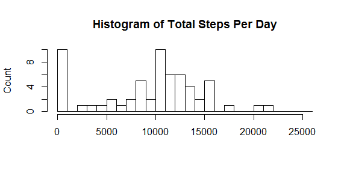
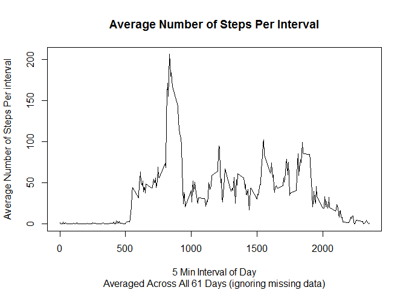
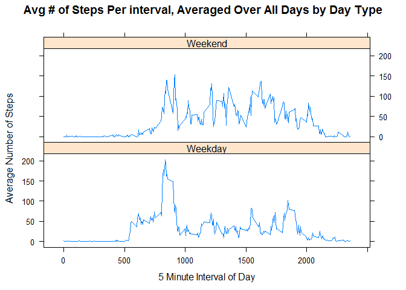

```r
# set global chunk options  

knitr::opts_chunk$set(echo=TRUE)
options(digits=2)
```

# Reproducible Research: Peer Assessment 1
by Melinda Higgins
dated 07/20/2014

## Loading and preprocessing the data

### STEP 1: Load the data


```r
# The following code assumes a relative path where 
# the data are located in a subdirectory called "/data/"

activityData <- read.csv("data/activity.csv", header=TRUE)
```

### STEP 2: Check header 1st 5 rows of data to check format and names of columns of dataset.


```r
# Look at the 1st 5 rows of the data
# also check the column names

head(activityData)
```

```
##   steps       date interval
## 1    NA 2012-10-01        0
## 2    NA 2012-10-01        5
## 3    NA 2012-10-01       10
## 4    NA 2012-10-01       15
## 5    NA 2012-10-01       20
## 6    NA 2012-10-01       25
```

```r
names(activityData)
```

```
## [1] "steps"    "date"     "interval"
```

## Summary of the dataset

The data contain 3 columns of data which are " steps, date, interval ".

There are 17568 rows of data covering 61 days. Each day the number of steps were recorded every 5 minutes during 24 hours for 288 total intervals per day.

### STEP 3: Compute the mean and median number of steps per day 

The key to this part of the assignment is figuring out the total number of steps taken each day and then take the average over the total number of days.


```r
# compute the total number of steps per date

TLstepsByDay <- aggregate(activityData$steps, 
                          list(activityData$date),
                          sum, 
                          na.rm=TRUE)

# then calculate the mean and median total number of steps per day across all days

meanStepsByDay <- mean(TLstepsByDay[,2], na.rm=TRUE)
medianStepsByDay <- median(TLstepsByDay[,2], na.rm=TRUE)
```

* The MEAN number of TOTAL steps (ignoring missing values) taken PER day was 9354.23
* The MEDIAN number of TOTAL steps (ignoring missing values) taken PER day was 10395

### STEP 4: Create a Histogram of the Total Number of Steps Per Day


```r
# Create histogram with all the data including 0's but with NAs (missing)

brks <- seq(0,26000,1000)

hist(TLstepsByDay[,2], 
     xlab=" ", 
     ylab="Count", 
     breaks=brks,
     main="Histogram of Total Steps Per Day")
```

 

### STEP 5: What is the average daily activity pattern?

Make a time series plot of the 5-minute interval and the average number of steps taken, average across all days.


```r
# calculate the average number of steps per interval over all days

AvgstepsByInterval <- aggregate(activityData$steps, 
                                list(activityData$interval),
                                mean, 
                                na.rm=TRUE)

# make a line plot of the avg number of steps per interval

plot(AvgstepsByInterval[,1], AvgstepsByInterval[,2], 
     type="l", xlab="5 Min Interval of Day",
     ylab="Average Number of Steps Per interval", 
     main="Average Number of Steps Per Interval",
     sub="Averaged Across All 61 Days (ignoring missing data)")
```

 

### STEP 6: Which 5 minute interval on average across the number of days in the dataset contains the maximum number of AVERAGE steps?


```r
# use the whick.max function to find the interval which has the 
# highest avg number of steps

IntervalMax <- AvgstepsByInterval[which.max(AvgstepsByInterval[,2]),]
```

* The Interval which had the maximum number of average steps taken was interval 835 in which the average number of steps taken averaged across all 61 days was 206.17 steps.

## Imputing Missing Values


```r
# this step was done to gain additional insight into the dataset
# with respect to the amount of missing data and the 
# number of 0's in the data

# create a copy of the dataset where the number of steps 
# was NOT missing AND were > 0

nomissing <- activityData[activityData$steps>0 
                          & !is.na(activityData$steps),]
```

* There are a total of 2304 NA's (missing values);
* There are 11014 zeros (0's);
* and 4250 entries with non-zero steps ranging from 1 to 806 steps in the 5 minute intervals.

The assumption I'm making for the missing values is that these numbers are due to inactivity or times when the monitor was turned off most likely due to inactivity. For this reason, values of 0 will be substituted for the NAs.


```r
# Use ifelse to substitute a value of 0 for all NAs

activityData2 <- activityData
activityData2$stepsSub0 <- ifelse(is.na(activityData2$steps), 0, activityData2$steps)
```


```r
# use the aggregate function again to find the total number of 
# steps by date using the dataset with 0's substituted for the NAs

TLstepsByDay2 <- aggregate(activityData2$stepsSub0, 
                           list(activityData2$date),
                           sum, 
                           na.rm=TRUE)

meanStepsByDay2 <- mean(TLstepsByDay2[,2], na.rm=TRUE)
medianStepsByDay2 <- median(TLstepsByDay2[,2], na.rm=TRUE)
```

* The MEAN number of TOTAL steps (substituting 0's for missing values) taken PER day was 9354.23 - compare to MEAN number of TOTAL steps (ignoring missing values) taken PER day 9354.23
* The MEDIAN number of TOTAL steps (substituting 0's for missing values) taken PER day was 1.04 &times; 10<sup>4</sup> - compare to MEDIAN number of TOTAL steps (ignoring missing values) taken PER day 10395
* These are NOT different since the total number of steps with the missing data substituted as 0's is the same as the total number of steps ignoring the missing data. Other non-zero substitutions would make a difference. However, given the zero-inflation and skewed nature of this data using 0 as a substitution is appropriate.

### Additional observation on high values

Also note that Some of these high values seem extreme - possibly too many steps recorded in a 5 minute interval. For example, the maximum number of steps of 806 in 5 minutes implies making 2.69 steps every second.

### Create the Histogram of the Total Number of Steps Per Day With the Substitution of 0's for NA's


```r
# Create histogram (A) with all the data including 0's but with NAs (missing)

brks <- seq(0,26000,1000)

hist(TLstepsByDay2[,2], 
     xlab=" ", 
     ylab="Count", 
     breaks=brks,
     main="Histogram of Total Steps Per Day")
```

 

## Look at the activity patterns between weekdays and weekends


```r
# find a way to extract the days as days of the week
# and then code the weekends and weekdays differently.
# use this factor in the following plot.

days <- as.data.frame(table(activityData$date))[,1]
checkWkDays <- weekdays(as.Date(days))
NumWkDays <- as.POSIXlt(days)$wday
isweekend <- ((NumWkDays==0)|(NumWkDays==6))

# check alignment of data
# cbind(checkWkDays, NumWkDays, isweekend)
```

## Make a panel plot of the 5-minute interval average for weekdays and weekends.


```r
# coding for setting up factor for weekends and weekdays for plot

activityData2$weekday <- as.POSIXlt(activityData2$date)$wday
activityData2$isweekend <- as.numeric((activityData2$weekday==0) | 
                                        (activityData2$weekday==6))

AvgstepsByInterval3 <- aggregate(activityData2$stepsSub0, 
                                 list(activityData2$interval, 
                                      activityData2$isweekend),
                                 mean, 
                                 na.rm=TRUE)

# use the xyplot function from the lattice package

library(lattice)

wkend <- factor(AvgstepsByInterval3[,2], 
                labels=c("Weekday","Weekend"))

xyplot(AvgstepsByInterval3[,3] ~ AvgstepsByInterval3[,1] | wkend,
       type="l", layout=c(1,2), 
       xlab="5 Minute Interval of Day", 
       ylab="Average Number of Steps", 
       main="Avg # of Steps Per interval, Averaged Over All Days by Day Type")
```

 


