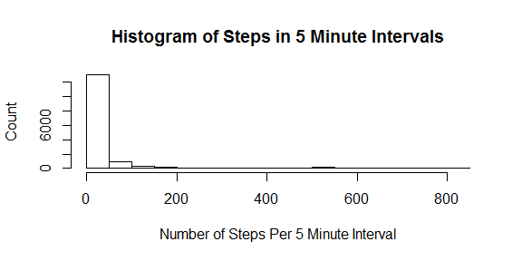
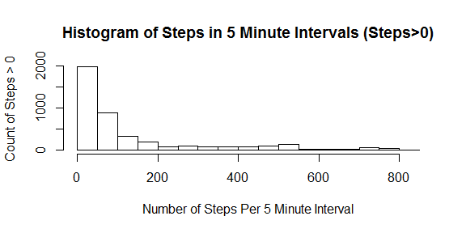
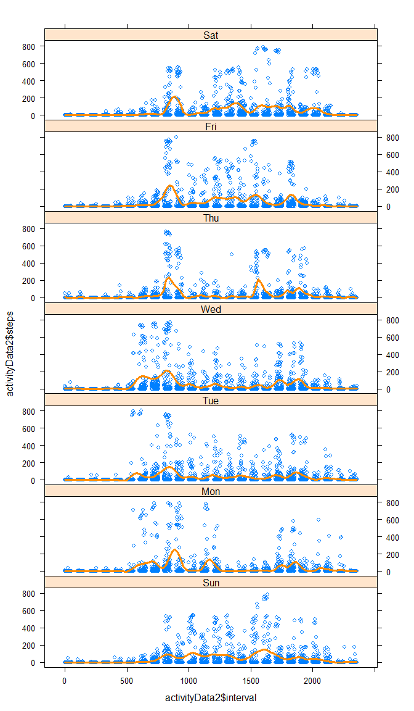

```r
# set global chunk options  

knitr::opts_chunk$set(echo=TRUE)
options(digits=2)
```

# Reproducible Research: Peer Assessment 1
by Melinda Higgins
dated 07/15/2014

## Loading and preprocessing the data


```r
# The following code assumes a relative path where 
# the data are located in a subdirectory called "/data/"

activityData <- read.csv("data/activity.csv", header=TRUE)
```

### Summary of the dataset

The data contain 3 columns of data which are " steps, date, interval ".

There are 17568 rows of data covering 61 days. Each day the number of steps were recorded every 5 minutes during 24 hours for 288 total intervals per day.

### Missing data, Zeros, and Potential Extreme Values (Potential Outliers)


```r
# create a copy of the dataset where the number of steps 
# was NOT missing AND were > 0

nomissing <- activityData[activityData$steps>0 & !is.na(activityData$steps),]
```

* There are 2304 NA's (missing values);
* There are 11014 zeros (0's);
* and 4250 entries with non-zero steps ranging from 1 to 806 steps in the 5 minute intervals.

Some of these high values seem extreme - possibly too many steps recorded in a 5 minute interval. For example, the maximum number of steps of 806 in 5 minutes implies making 2.69 steps every second.

### Histogram of the Number of Steps Per 5 minute Interval: Including (A) Intervals with Zero steps and Missing Data and (B) For Intervals with the Number of Steps > 0 and no missing data.


```r
# Create histogram (A) with all the data including 0's and NAs (missing)

hist(activityData$steps, 
     xlab="Number of Steps Per 5 Minute Interval", 
     ylab="Count", 
     main="Histogram of Steps in 5 Minute Intervals")
```

 


```r
# Create histogram (B) for only the intervals >0 and no missing

hist(nomissing$steps, 
     xlab="Number of Steps Per 5 Minute Interval", 
     ylab="Count of Steps > 0", 
     main="Histogram of Steps in 5 Minute Intervals (Steps>0)")
```

 


## What is mean total number of steps taken per day?

Calculate the overall mean and the mean for each day. Also run for the medians per day and overall - with an without the "imputation" method tried below...


```r
meanSteps <- tapply(activityData$steps, 
                    activityData$interval, 
                    mean, na.rm=TRUE)
summary(meanSteps)
```

```
##    Min. 1st Qu.  Median    Mean 3rd Qu.    Max. 
##       0       2      34      37      53     206
```

```r
library(tables)
```

```
## Warning: package 'tables' was built under R version 3.1.1
```

```
## Loading required package: Hmisc
## Loading required package: grid
## Loading required package: lattice
## Loading required package: survival
## Loading required package: splines
## Loading required package: Formula
## 
## Attaching package: 'Hmisc'
## 
## The following objects are masked from 'package:base':
## 
##     format.pval, round.POSIXt, trunc.POSIXt, units
```

```r
# this sort of works but won't work with the NAs
tabular((as.factor(interval)+1)~(n=1)+Format(digits=2)*(steps)*(mean + sd), data=nomissing)
```

```
##                                        
##                           steps        
##  as.factor(interval) n    mean   sd    
##  0                      3  30.33  18.77
##  5                      1  18.00     NA
##  10                     1   7.00     NA
##  15                     1   8.00     NA
##  20                     1   4.00     NA
##  25                     4  27.75  19.48
##  30                     1  28.00     NA
##  35                     1  46.00     NA
##  45                     2  39.00  46.67
##  50                     2   8.00   0.00
##  55                     1   7.00     NA
##  100                    1  17.00     NA
##  105                    1  36.00     NA
##  110                    1   8.00     NA
##  115                    1  18.00     NA
##  125                    1  59.00     NA
##  130                    4  24.25  18.26
##  135                    1   9.00     NA
##  140                    2   4.50   0.71
##  145                    2  10.00   1.41
##  150                    1  14.00     NA
##  210                    2  30.00  36.77
##  225                    1   7.00     NA
##  235                    1  12.00     NA
##  250                    4  20.50  14.62
##  255                    1  50.00     NA
##  320                    1  11.00     NA
##  325                    1  33.00     NA
##  330                    3  28.67  17.93
##  335                    3  10.33   2.08
##  340                    2  13.00   4.24
##  345                    1   4.00     NA
##  400                    2  31.50  37.48
##  405                    2  25.00  19.80
##  410                    4  34.00  24.62
##  420                    2   9.00   0.00
##  425                    1  19.00     NA
##  430                    5  43.60  15.88
##  435                    2  17.50  16.26
##  440                    3  61.67  68.22
##  445                    3  14.67   5.51
##  450                    5  33.00  25.07
##  455                    5  11.80   5.36
##  505                    4  20.75  11.73
##  510                    4  39.75  43.18
##  515                    3  39.67  24.99
##  520                    4  44.00  29.92
##  525                    4  39.25  21.96
##  530                    3  37.00  25.06
##  535                    5  64.20  76.09
##  540                    5 169.80 319.88
##  545                    7 138.86 273.99
##  550                    8 261.38 330.33
##  555                   14 168.43 258.25
##  600                    9 185.44 256.69
##  605                   10 261.10 331.71
##  610                   13 219.23 310.41
##  615                   20 168.15 264.37
##  620                   15 176.53 256.90
##  625                   18 138.61 238.79
##  630                   22 125.64 227.54
##  635                   20 104.25 151.20
##  640                   25  93.32 145.46
##  645                   24  97.54 172.81
##  650                   28  70.71 112.30
##  655                   29  89.62 138.64
##  700                   27  86.00 145.78
##  705                   29  81.10 146.32
##  710                   31  86.35 177.76
##  715                   26 111.12 191.92
##  720                   25 105.84 204.32
##  725                   31  87.16 180.18
##  730                   25 118.04 171.36
##  735                   26  90.35 140.00
##  740                   29  95.52 123.22
##  745                   36 102.39 144.96
##  750                   32  95.81 124.72
##  755                   38  78.32 100.25
##  800                   38 102.34 134.54
##  805                   35 103.29 109.25
##  810                   33 207.88 218.21
##  815                   29 287.90 306.70
##  820                   37 245.16 274.93
##  825                   33 249.58 267.71
##  830                   36 261.03 264.56
##  835                   31 352.48 309.04
##  840                   35 296.69 274.44
##  845                   31 307.00 241.69
##  850                   30 324.00 282.77
##  855                   31 285.55 254.22
##  900                   33 230.39 248.61
##  905                   28 234.79 225.20
##  910                   32 180.72 205.17
##  915                   28 204.64 209.86
##  920                   29 189.55 199.66
##  925                   22 231.18 239.41
##  930                   22 159.50 214.39
##  935                   18 133.17 177.33
##  940                   15  87.60 111.74
##  945                   21  97.81 136.20
##  950                   19  97.58 114.41
##  955                   10 111.60  88.77
##  1000                  12 179.17 171.30
##  1005                   8 178.75 166.74
##  1010                  12 187.33 164.26
##  1015                  13 214.69 191.46
##  1020                  15 137.53 144.08
##  1025                  14 192.29 198.93
##  1030                  17 138.06 150.38
##  1035                  12 165.25 198.59
##  1040                  11 167.18 154.77
##  1045                  15 100.13 139.75
##  1050                  13 102.31 101.22
##  1055                  22  76.95  90.74
##  1100                  17  97.76  98.98
##  1105                  16  98.31 117.43
##  1110                  16  70.62  83.19
##  1115                  13 104.15  81.52
##  1120                  14 107.43 125.70
##  1125                  16  87.69  92.55
##  1130                  20  88.60 117.17
##  1135                  21 126.14 162.82
##  1140                  20 111.40 185.38
##  1145                  18 131.33 191.60
##  1150                  21 116.19 173.72
##  1155                  22 142.59 165.00
##  1200                  23 147.17 129.13
##  1205                  24 193.67 176.45
##  1210                  27 186.19 184.96
##  1215                  27 182.11 170.77
##  1220                  24 140.00 144.03
##  1225                  22 120.86 124.84
##  1230                  21 137.48 160.89
##  1235                  19  90.42 133.21
##  1240                  14 100.43 138.03
##  1245                  15 133.33 155.47
##  1250                  20 119.40 153.30
##  1255                  19 187.68 167.77
##  1300                  16 140.25 177.03
##  1305                  13 162.62 174.67
##  1310                  12 191.08 197.59
##  1315                  11 197.45 197.99
##  1320                  17 144.18 157.06
##  1325                  18 166.17 147.58
##  1330                  18 125.89 112.64
##  1335                  15  88.80  93.49
##  1340                  14 151.29 151.20
##  1345                  20 141.90 155.77
##  1350                  18 139.33 171.16
##  1355                  20 161.15 161.43
##  1400                  18 164.17 185.26
##  1405                  21 131.14 151.80
##  1410                  16 144.38 156.44
##  1415                  20 129.05 165.32
##  1420                  17 110.59 112.69
##  1425                  16 124.38 124.27
##  1430                  20 110.90 139.49
##  1435                  19  76.74  85.22
##  1440                  16  56.69  46.43
##  1445                  14  98.71 119.09
##  1450                  19 121.68 161.22
##  1455                  17 136.47 181.79
##  1500                  12 132.58 171.45
##  1505                  14 136.57 147.27
##  1510                  14 134.36 199.66
##  1515                  14 147.07 199.76
##  1520                  15 162.40 221.35
##  1525                  17 148.88 208.97
##  1530                  15 170.07 208.90
##  1535                  18 192.33 220.38
##  1540                  16 274.62 215.47
##  1545                  23 227.35 177.80
##  1550                  20 270.60 237.33
##  1555                  20 222.50 232.37
##  1600                  22 149.68 198.31
##  1605                  18 188.83 245.38
##  1610                  16 246.94 273.23
##  1615                  18 186.00 258.52
##  1620                  18 167.56 264.04
##  1625                  14 226.29 283.14
##  1630                  16 145.31 232.89
##  1635                  14 146.00 222.10
##  1640                  16 147.94 173.00
##  1645                  17 141.71 195.96
##  1650                  19 128.89 163.72
##  1655                  17 136.18 149.66
##  1700                  22 112.32 174.43
##  1705                  17 175.53 218.75
##  1710                  22 122.18 178.80
##  1715                  27 120.19 160.19
##  1720                  28 137.64 160.51
##  1725                  25 167.36 187.13
##  1730                  27 135.33 180.00
##  1735                  27 117.11 120.24
##  1740                  37 107.57 122.65
##  1745                  28 106.96 138.85
##  1750                  25  73.72  96.37
##  1755                  29  68.45  90.75
##  1800                  28  77.00  79.30
##  1805                  33  93.18 121.81
##  1810                  36 109.97 137.05
##  1815                  37 122.22 154.85
##  1820                  33  95.18 112.20
##  1825                  29 123.86 154.00
##  1830                  36 114.39 154.57
##  1835                  36 109.31 154.53
##  1840                  37 122.24 156.72
##  1845                  41 128.56 162.10
##  1850                  38 120.76 153.92
##  1855                  34 133.44 166.45
##  1900                  36 124.94 157.27
##  1905                  37 111.49 140.22
##  1910                  27 113.93 150.95
##  1915                  29  97.52 143.96
##  1920                  28  68.75  79.14
##  1925                  26  42.23  39.03
##  1930                  24  60.50  50.35
##  1935                  20 106.05 145.11
##  1940                  20  80.05  94.23
##  1945                  17  79.65 119.09
##  1950                  18 134.44 159.69
##  1955                  18  98.72 143.05
##  2000                  15  69.33 118.04
##  2005                   9 112.00 167.89
##  2010                  15  68.33 115.77
##  2015                  17 103.94 150.10
##  2020                  10 142.10 189.74
##  2025                   8 140.25 218.94
##  2030                  13 111.31 147.94
##  2035                  11 102.82 158.25
##  2040                  12  86.33 139.36
##  2045                  12  94.17 135.13
##  2050                  18  95.11 159.27
##  2055                  13  82.15  85.94
##  2100                  15  56.33  48.80
##  2105                  14  65.21  89.89
##  2110                  16  77.69  63.19
##  2115                  16  63.75  49.57
##  2120                  11  60.00  36.29
##  2125                  14  30.36  25.47
##  2130                  12  64.75  44.58
##  2135                   8 108.00 128.74
##  2140                  10  46.00  35.64
##  2145                   5  82.60 112.72
##  2150                   6  71.83  62.70
##  2155                   5  27.80  20.85
##  2200                   3  25.67  21.36
##  2205                   4  48.75  41.00
##  2210                   4  63.75  50.68
##  2215                   8  56.38  42.67
##  2220                   6  62.50  62.15
##  2225                   5  92.20 166.00
##  2230                   7  73.86 143.05
##  2235                   2  58.50   4.95
##  2240                   1  17.00     NA
##  2245                   1   6.00     NA
##  2250                   3  28.33  26.08
##  2255                   2 122.00  83.44
##  2300                   6  29.17  36.23
##  2305                   3  50.33  44.79
##  2315                   2  22.00   2.83
##  2320                   1  51.00     NA
##  2325                   5  16.80  15.29
##  2330                   4  34.50  16.70
##  2335                   3  83.00  81.10
##  2340                   3  58.33  38.81
##  2345                   2  17.00  12.73
##  2350                   2   6.00   2.83
##  2355                   3  19.00  10.54
##  All                 4250 134.26 179.01
```

```r
# also
aa <- aggregate(activityData$steps, 
                list(activityData$interval), 
                mean, 
                na.rm=TRUE)
names(aa) <- c("Interval","Average Number of Steps")
aa[which.max(aa[,2]),]
```

```
##     Interval Average Number of Steps
## 104      835                     206
```

```r
# load chron and lattice libraries

library(chron)
library(lattice)

# Use chron() function to create chronological objects for times and days

activitydate <- chron(as.character(activityData$date),
                      format=c(dates="y-m-d"),
                      out.format=c("day months year"))

# create copy fo original dataset, add extracted dates and times
# and then extract the day of the week

activityData2 <- activityData
activityData2$date2 <- activitydate
activityData2$weekday <- weekdays(activityData2$date2)

# now sort over interval and Day of week

aa2 <- aggregate(activityData2$steps, 
                list(activityData2$interval, activityData2$weekday), 
                mean, 
                na.rm=TRUE)

names(aa2) <- c("Interval","Day of Week","Average Number of Steps")
aa2[which.max(aa2[,3]),]
```

```
##      Interval Day of Week Average Number of Steps
## 1547      850         Fri                     329
```


## What is the average daily activity pattern?

Look at the raw data - scatterplot by time of day (the increments) - look at overall and by day of the week - also look at a table summarizing these data given the n, mean, median, maybe Q1, Q3, min and max - over all 61 days by time of day and again by day of week. make some plots to go along with...


```r
# load chron and lattice libraries

#library(chron)
#library(lattice)

# Use chron() function to create chronological objects for times and days

#activitydate <- chron(as.character(activityData$date),
#                      format=c(dates="y-m-d"),
#                      out.format=c("day months year"))

# create copy fo original dataset, add extracted dates and times
# and then extract the day of the week

#activityData2 <- activityData
#activityData2$date2 <- activitydate
#activityData2$weekday <- weekdays(activityData2$date2)

# create an xyplot using the lattice package and ploy Day of Week separately

xyplot(activityData2$steps ~ activityData2$interval | factor(activityData2$weekday),
       type=c("p","spline"),
       col.line="darkorange",
       lwd=3, 
       layout=c(1,7))
```

 


```r
# test of xtable function for lm fit summary

library(xtable)
```

```
## 
## Attaching package: 'xtable'
## 
## The following objects are masked from 'package:Hmisc':
## 
##     label, label<-
```

```r
fitlm <- lm(activityData2$steps ~ activityData2$interval)
fitlmxtable <- xtable(fitlm)
print.xtable(fitlmxtable,type="html")
```

<!-- html table generated in R 3.1.0 by xtable 1.7-3 package -->
<!-- Tue Jul 15 23:11:11 2014 -->
<TABLE border=1>
<TR> <TH>  </TH> <TH> Estimate </TH> <TH> Std. Error </TH> <TH> t value </TH> <TH> Pr(&gt;|t|) </TH>  </TR>
  <TR> <TD align="right"> (Intercept) </TD> <TD align="right"> 29.5539 </TD> <TD align="right"> 1.7868 </TD> <TD align="right"> 16.54 </TD> <TD align="right"> 0.0000 </TD> </TR>
  <TR> <TD align="right"> activityData2$interval </TD> <TD align="right"> 0.0066 </TD> <TD align="right"> 0.0013 </TD> <TD align="right"> 5.08 </TD> <TD align="right"> 0.0000 </TD> </TR>
   </TABLE>

```r
testdataf <- activityData2[1:30,]
testdataf.xtable <- xtable(activityData2[1:30,])
print(testdataf.xtable, type="html", floating=FALSE)
```

```
## Warning: class of 'x' was discarded
```

<!-- html table generated in R 3.1.0 by xtable 1.7-3 package -->
<!-- Tue Jul 15 23:11:11 2014 -->
<TABLE border=1>
<TR> <TH>  </TH> <TH> steps </TH> <TH> date </TH> <TH> interval </TH> <TH> date2 </TH> <TH> weekday </TH>  </TR>
  <TR> <TD align="right"> 1 </TD> <TD align="right">  </TD> <TD> 2012-10-01 </TD> <TD align="right">   0 </TD> <TD align="right"> 15614.00 </TD> <TD> Mon </TD> </TR>
  <TR> <TD align="right"> 2 </TD> <TD align="right">  </TD> <TD> 2012-10-01 </TD> <TD align="right">   5 </TD> <TD align="right"> 15614.00 </TD> <TD> Mon </TD> </TR>
  <TR> <TD align="right"> 3 </TD> <TD align="right">  </TD> <TD> 2012-10-01 </TD> <TD align="right">  10 </TD> <TD align="right"> 15614.00 </TD> <TD> Mon </TD> </TR>
  <TR> <TD align="right"> 4 </TD> <TD align="right">  </TD> <TD> 2012-10-01 </TD> <TD align="right">  15 </TD> <TD align="right"> 15614.00 </TD> <TD> Mon </TD> </TR>
  <TR> <TD align="right"> 5 </TD> <TD align="right">  </TD> <TD> 2012-10-01 </TD> <TD align="right">  20 </TD> <TD align="right"> 15614.00 </TD> <TD> Mon </TD> </TR>
  <TR> <TD align="right"> 6 </TD> <TD align="right">  </TD> <TD> 2012-10-01 </TD> <TD align="right">  25 </TD> <TD align="right"> 15614.00 </TD> <TD> Mon </TD> </TR>
  <TR> <TD align="right"> 7 </TD> <TD align="right">  </TD> <TD> 2012-10-01 </TD> <TD align="right">  30 </TD> <TD align="right"> 15614.00 </TD> <TD> Mon </TD> </TR>
  <TR> <TD align="right"> 8 </TD> <TD align="right">  </TD> <TD> 2012-10-01 </TD> <TD align="right">  35 </TD> <TD align="right"> 15614.00 </TD> <TD> Mon </TD> </TR>
  <TR> <TD align="right"> 9 </TD> <TD align="right">  </TD> <TD> 2012-10-01 </TD> <TD align="right">  40 </TD> <TD align="right"> 15614.00 </TD> <TD> Mon </TD> </TR>
  <TR> <TD align="right"> 10 </TD> <TD align="right">  </TD> <TD> 2012-10-01 </TD> <TD align="right">  45 </TD> <TD align="right"> 15614.00 </TD> <TD> Mon </TD> </TR>
  <TR> <TD align="right"> 11 </TD> <TD align="right">  </TD> <TD> 2012-10-01 </TD> <TD align="right">  50 </TD> <TD align="right"> 15614.00 </TD> <TD> Mon </TD> </TR>
  <TR> <TD align="right"> 12 </TD> <TD align="right">  </TD> <TD> 2012-10-01 </TD> <TD align="right">  55 </TD> <TD align="right"> 15614.00 </TD> <TD> Mon </TD> </TR>
  <TR> <TD align="right"> 13 </TD> <TD align="right">  </TD> <TD> 2012-10-01 </TD> <TD align="right"> 100 </TD> <TD align="right"> 15614.00 </TD> <TD> Mon </TD> </TR>
  <TR> <TD align="right"> 14 </TD> <TD align="right">  </TD> <TD> 2012-10-01 </TD> <TD align="right"> 105 </TD> <TD align="right"> 15614.00 </TD> <TD> Mon </TD> </TR>
  <TR> <TD align="right"> 15 </TD> <TD align="right">  </TD> <TD> 2012-10-01 </TD> <TD align="right"> 110 </TD> <TD align="right"> 15614.00 </TD> <TD> Mon </TD> </TR>
  <TR> <TD align="right"> 16 </TD> <TD align="right">  </TD> <TD> 2012-10-01 </TD> <TD align="right"> 115 </TD> <TD align="right"> 15614.00 </TD> <TD> Mon </TD> </TR>
  <TR> <TD align="right"> 17 </TD> <TD align="right">  </TD> <TD> 2012-10-01 </TD> <TD align="right"> 120 </TD> <TD align="right"> 15614.00 </TD> <TD> Mon </TD> </TR>
  <TR> <TD align="right"> 18 </TD> <TD align="right">  </TD> <TD> 2012-10-01 </TD> <TD align="right"> 125 </TD> <TD align="right"> 15614.00 </TD> <TD> Mon </TD> </TR>
  <TR> <TD align="right"> 19 </TD> <TD align="right">  </TD> <TD> 2012-10-01 </TD> <TD align="right"> 130 </TD> <TD align="right"> 15614.00 </TD> <TD> Mon </TD> </TR>
  <TR> <TD align="right"> 20 </TD> <TD align="right">  </TD> <TD> 2012-10-01 </TD> <TD align="right"> 135 </TD> <TD align="right"> 15614.00 </TD> <TD> Mon </TD> </TR>
  <TR> <TD align="right"> 21 </TD> <TD align="right">  </TD> <TD> 2012-10-01 </TD> <TD align="right"> 140 </TD> <TD align="right"> 15614.00 </TD> <TD> Mon </TD> </TR>
  <TR> <TD align="right"> 22 </TD> <TD align="right">  </TD> <TD> 2012-10-01 </TD> <TD align="right"> 145 </TD> <TD align="right"> 15614.00 </TD> <TD> Mon </TD> </TR>
  <TR> <TD align="right"> 23 </TD> <TD align="right">  </TD> <TD> 2012-10-01 </TD> <TD align="right"> 150 </TD> <TD align="right"> 15614.00 </TD> <TD> Mon </TD> </TR>
  <TR> <TD align="right"> 24 </TD> <TD align="right">  </TD> <TD> 2012-10-01 </TD> <TD align="right"> 155 </TD> <TD align="right"> 15614.00 </TD> <TD> Mon </TD> </TR>
  <TR> <TD align="right"> 25 </TD> <TD align="right">  </TD> <TD> 2012-10-01 </TD> <TD align="right"> 200 </TD> <TD align="right"> 15614.00 </TD> <TD> Mon </TD> </TR>
  <TR> <TD align="right"> 26 </TD> <TD align="right">  </TD> <TD> 2012-10-01 </TD> <TD align="right"> 205 </TD> <TD align="right"> 15614.00 </TD> <TD> Mon </TD> </TR>
  <TR> <TD align="right"> 27 </TD> <TD align="right">  </TD> <TD> 2012-10-01 </TD> <TD align="right"> 210 </TD> <TD align="right"> 15614.00 </TD> <TD> Mon </TD> </TR>
  <TR> <TD align="right"> 28 </TD> <TD align="right">  </TD> <TD> 2012-10-01 </TD> <TD align="right"> 215 </TD> <TD align="right"> 15614.00 </TD> <TD> Mon </TD> </TR>
  <TR> <TD align="right"> 29 </TD> <TD align="right">  </TD> <TD> 2012-10-01 </TD> <TD align="right"> 220 </TD> <TD align="right"> 15614.00 </TD> <TD> Mon </TD> </TR>
  <TR> <TD align="right"> 30 </TD> <TD align="right">  </TD> <TD> 2012-10-01 </TD> <TD align="right"> 225 </TD> <TD align="right"> 15614.00 </TD> <TD> Mon </TD> </TR>
   </TABLE>

### Summary Statistics for Number of Steps in 5 Minute Intervals


```r
# second test of xtable using summary statistics

sumsteps <- summary(activityData2$steps)
sumstepsxtable <- xtable(table(sumsteps))
print.xtable(sumstepsxtable, type="html")
```

<!-- html table generated in R 3.1.0 by xtable 1.7-3 package -->
<!-- Tue Jul 15 23:11:11 2014 -->
<TABLE border=1>
<TR> <TH>  </TH> <TH> sumsteps </TH>  </TR>
  <TR> <TD align="right"> 0 </TD> <TD align="right">   3 </TD> </TR>
  <TR> <TD align="right"> 12 </TD> <TD align="right">   1 </TD> </TR>
  <TR> <TD align="right"> 37.4 </TD> <TD align="right">   1 </TD> </TR>
  <TR> <TD align="right"> 806 </TD> <TD align="right">   1 </TD> </TR>
  <TR> <TD align="right"> 2304 </TD> <TD align="right">   1 </TD> </TR>
   </TABLE>

### Summary Statistics for Number of Steps (in 5 min interval)
=============================================================
Statistic   | Value
----------- | ----------
Mean        | 37.38
Median      | 0
SD          | 112
Min         | 0
Max         | 806


## Imputing missing values

Need to consider why the data are "missing" (NA's). These are most likely due to inactivity, although zeros were also recorded during other entries. Perhaps the NAs are due to the monitor being turned off or other reason no data was recorded. 

If we assume that the NA's are due to inactivity then substituting 0's for NA would be appropriate. If this cannot be confirmed, a smoothing approach could be used taking a simple average of the reading before and after the NA is noted. Although if the reading before and after are both NAs then perhaps a zero is best.

However, the number of steps are highly right-skewed with obvious zero-inflation. This distribution indicates that using the mean to substitute for the NAs is not appropriate. Instead using the median would be better - although these are essentially zero for every day as well - again suggesting that substituting zero's for the NAs would be appropriate.

It is noted that without a proper explanation for the source of the NAs, any method used for substitution will be biased. To what extent the chosen method is biased is unverifiable without further information.


## Are there differences in activity patterns between weekdays and weekends?

Need to figure out what function is needed to extract day of the week from the provided dates. Also need to check the date formatting...

